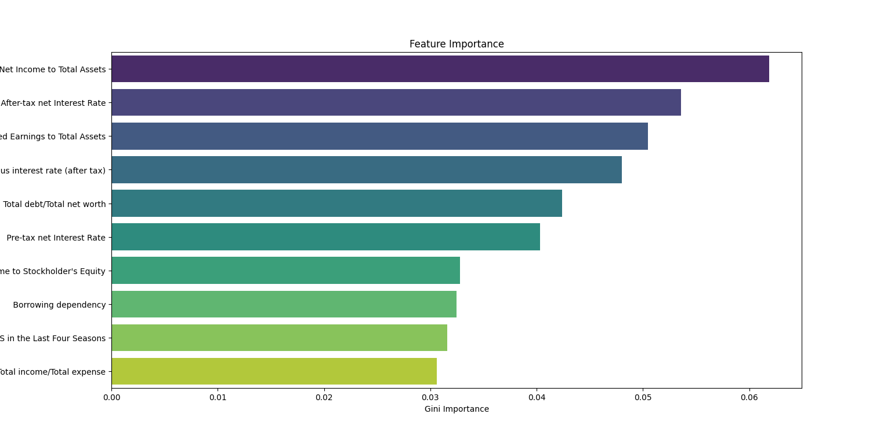
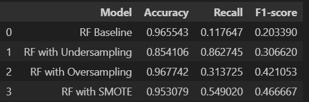
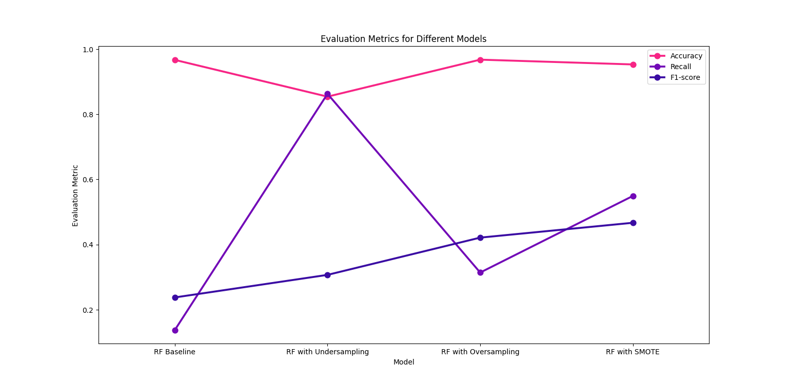

# Project_bankruptcy
This project works on Company Bankruptcy Prediction dataset  to create prediction about possible bankruptcy status of companies.
## Tools
- numpy 
- pandas
- matplotlib
- seaborn
- scikit-learn
- imblearn
## Steps
1. Data Preparation
2. Exploratory Data Analysis (EDA)

3. Random Forest Modeling
3.1. Baseline Model
3.2 Model With Undersampling
3.3 Model With Oversampling
3.4 Model With SMOTE
4. Feature Selection

5. Conclusion

